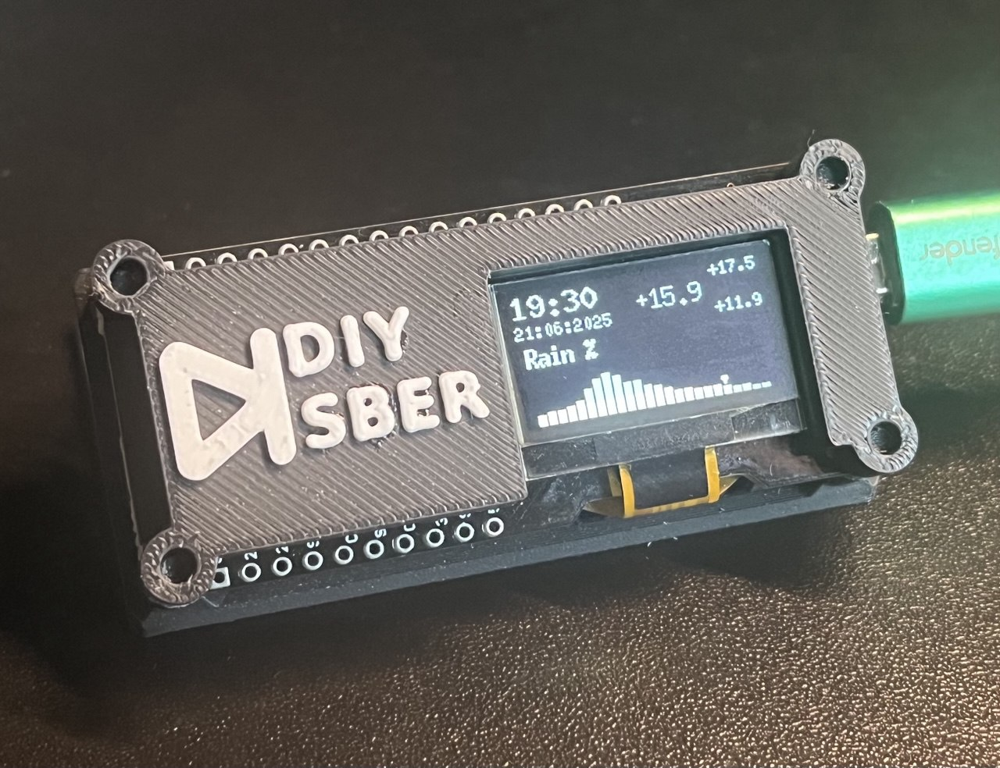
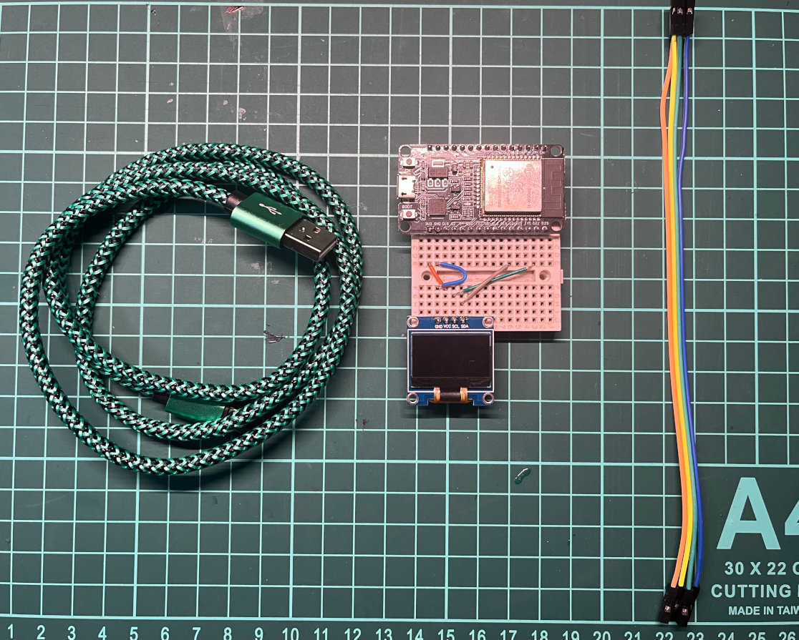
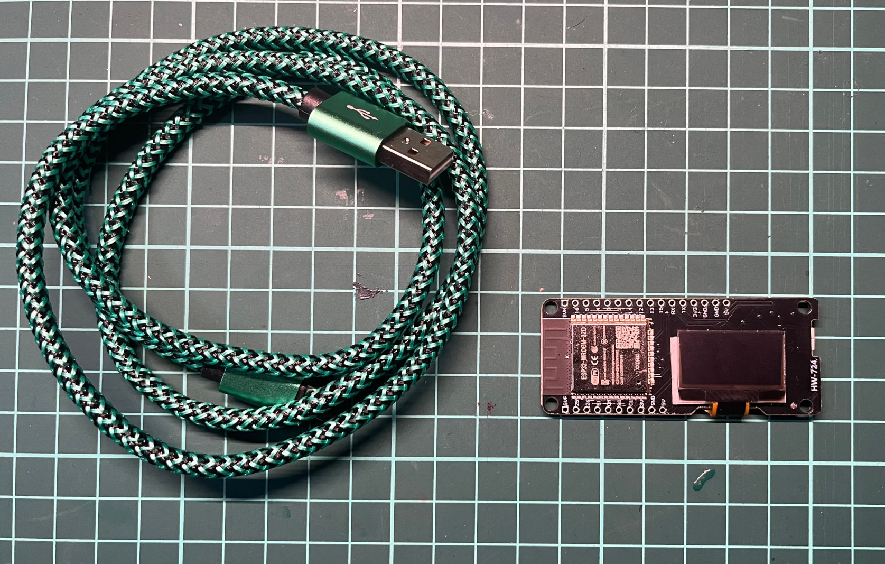
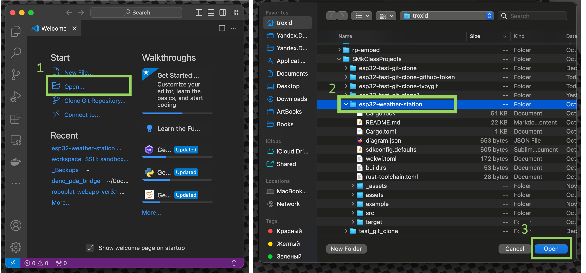
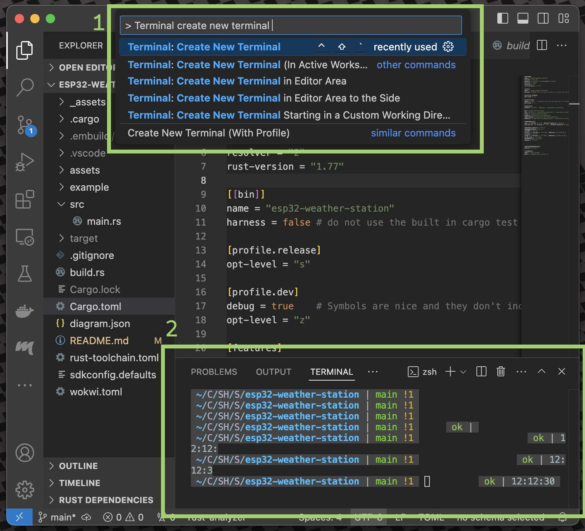
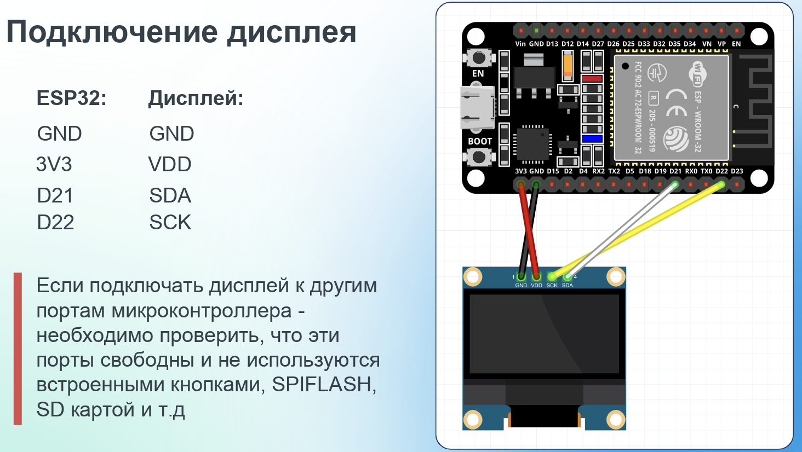
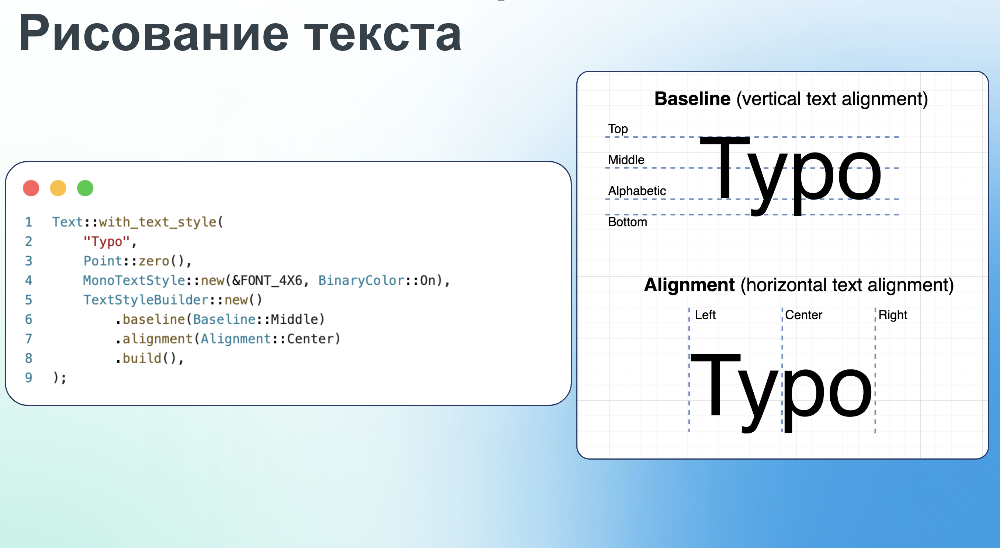
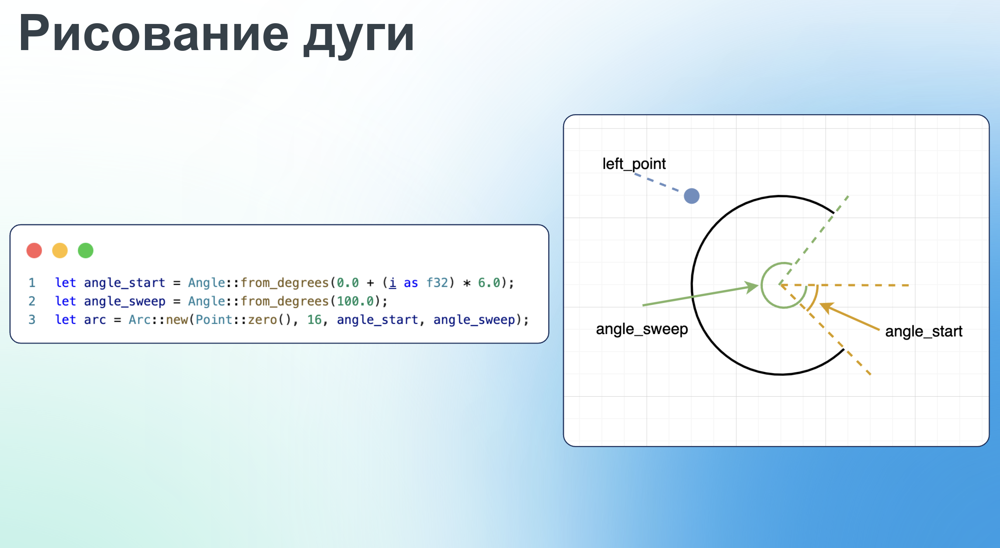
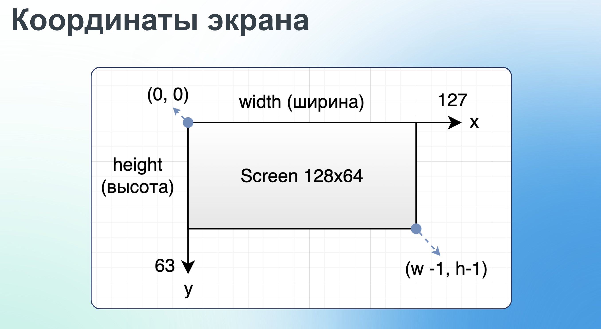
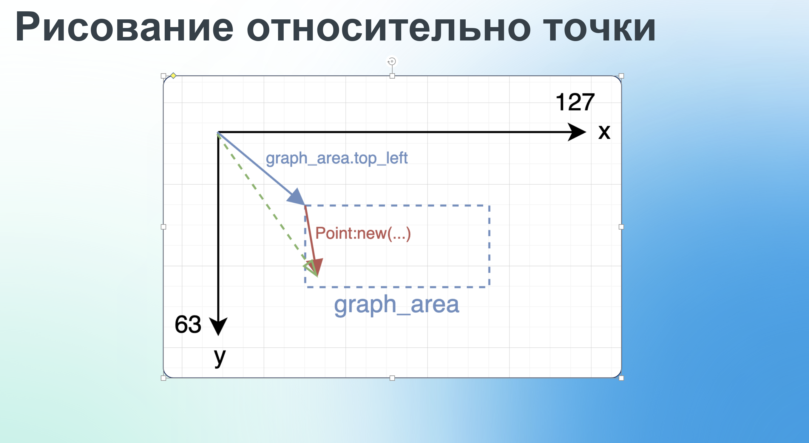

# esp-rust-no-std-weather-station



Простой метеоинформер на базе esp32 + rust + [embassy](https://embassy.dev/). Показывает актуальную погоду с [open-meteo](https://open-meteo.com/en/docs)
Embassy - Асинхронный рантайм для no_std rust  


# Необходимые материалы

- Ноутбук/ПК (Linux, MacOS, Windows) для разработки и прошивки МК
- Кабель USB для подключения к МК (ответная часть зависит от девкита)
- Экран PMOLED монохромный на базе контроллера **SSD1306**
- Devkit на базе микроконтроллера ESP32
- WiFi точка доступа 2.4ГГц с выходом в интернет (для МК)

Купить или использовать можно любые девкиты и экраны, главное что бы

- экран должен быть на базе **SSD1306**
- devkit должен быть на базе **ESP32**

Так же необходимо найти и скачать распиновку для своего МК. Гуглится по ключевому слову pinout, например:
`pinout ESP32-WROOM-32 NodeMCU`

Примеры комплектов:

## Экран и МК отдельно



> **Warning**  
> Экран и девкит может поставляться с незапаянными штырьковыми разъемами! Может потребоваться пайка

[OLED SSD1306](https://www.ozon.ru/product/oled-displey-0-96-128x64-i2c-belyy-945285571/?avtc=1&avte=4&avts=1731359337)

[ESP32](https://www.ozon.ru/product/esp32-devkit-38pin-kontroller-esp32-wroom-32-1712466151/?asb=4YstCflXD96uqMLauwoLdrpQV2di4mSfafcY9jjcj3o%253D&asb2=bk60acPFqJK_qYXImt6teQC9dRnWb5UyF6-MYuU-WDKcL4FCB2stRmCAlbGafX-QRJ-LY2GJUSmEM0_6cqnxh0jgrXC6epUfEvWqbu-kjzlD2rVar6v3axaYR6WVz9pyqY0gomrz9zUqoeSl8QrVqzW93XDENFbmviQw-9MTRck&avtc=1&avte=4&avts=1731359541&keywords=esp32)

[Макетная плата на 170+ точек](https://www.ozon.ru/product/bespaechnaya-maketnaya-plata-breadboard-170-tochek-1012687498/?asb=ZDxXko1pTvutL5%252Fnh0tgzzfF6WZARy%252FAldmVRp5dI28%253D&asb2=2m27FwpI6os8QJ2bUvzGYKKIc0au6Ac-TJsu2VdWU55Rsg-_DqC2XvKI9Pe-TAwisEFotJ8S3YYK2E_z6lcfiw&avtc=1&avte=4&avts=1731360479&keywords=breadboard)

[Провода перемычки Dupont](https://www.ozon.ru/product/provoda-peremychki-dupont-30-sm-3-vida-po-40-sht-mama-mama-papa-papa-papa-mama-dlya-arduino-1051231534/?asb=riLQ0aCCIN%252B6T6zq6UEbic8gPR18Wndf2Yszn2b3QT4%253D&asb2=FVEu6zkxrJzi6G3g_BwEPUEp0TL1_IzPCrGzr6LAkosND_sPccnNYwZmBDbbhaO0r6n_EZnOLJErxg414yEy_A&avtc=1&avte=4&avts=1731360540&keywords=провода+для+ардуино)

## МК вместе с экраном на плате



В этом комплекте ничего паять и подключать между собой не нужно т.к. все располагается на одной плате.

[Devkit ESP32 + OLED SSD1306](https://www.ozon.ru/product/modul-esp32-s-oled-displeem-1564880460/?asb=PgnFzODZfTizrkdcvDZqZNNEV5%252BCMd23%252F6bvhsValaQ%253D&asb2=gliD0Zr4VXqWYXjIFnckd8Jth5iSS29j_IE9QG8ZCA2v7imw1e6HkU1YJUozNnDuqBbLOfhjWbvyZAQI19PmGA&avtc=1&avte=4&avts=1731359481&keywords=esp32+oled)

# Учебные метериалы и полезные ссылки

Rust:

- [Перевод официальной книги "Язык программирования Rust" (RU)](https://doc.rust-lang.ru/book/title-page.html)
- [Перевод книги "Rust на примерах" (RU)](https://doc.rust-lang.ru/stable/rust-by-example/index.html)
- [Шпаргалка синтиаксиса (learn X in Y minutes)](https://learnxinyminutes.com/ru/rust/)
- [Интерактивный тур по языку](https://tourofrust.com/00_ru.html)
- [Реализация различных алгоритмов на Rust](https://the-algorithms.com/language/rust)

Embedded Rust:

- [Книга "The Rust on ESP Book" ](https://docs.esp-rs.org/book/introduction.html)
- [Примеры использования ESP-IDF. Базовая перифирия (GPIO, I2C, ADC и т.д.)](https://github.com/esp-rs/esp-hal/tree/main/examples/src/bin)
- [Список полезных репозиториев для Rust Ebmbedded (awesome-embedded-rust)](https://github.com/rust-embedded/awesome-embedded-rust)
- [Сайт с готовыми драйверами для периферии (170+). Температурные датчики, акселерометры, дисплеи и т.д.](https://tweedegolf.github.io/drive-rs/)
- [Embassy Book](https://embassy.dev/book/)
- [Введение в Embassy (youtube)](https://www.youtube.com/watch?v=pDd5mXBF4tY)

# Настройка окружения

Для тех у кого уже установлен rust, можно перейти к
шагу [3 Установка ESP для Rust](README.MD#3-Установка-ESP-утилит-для-Rust)

Так же, что бы пропустить этап настройки, можно воспользоваться готовым образом для виртуальной машины *Virtual Box* с
настроенным окружением:
[ubuntu-esp-rust (яндекс диск)](https://disk.yandex.com/d/BcbxjNeOJRSc9Q)

```
user: admin
pass: admin
```

## 1 Установка rust

На главной странице будет скрипт или инсталятор, который необходимо запустить

```
https://rustup.rs
```

Выбирать nightly

На Windows машинах должен быть предустановлен `.net framework 4.8` и выше
Для Windows машин, необходимо выбрать опцию:

```
1) Quick install via the Visual Studio Community installer
```

После этого будут доступны следующие командные утилиты:

- `cargo` - пакетный менеджер проектов на rust, запуск и сборка проектов.
- `rustup` - утилита для обновления тулчеинов, версии компилятора rust, а так же переключение на stable, beta и nightly
  ветку компилятора.
- `rustc` - компилятор rust (пользователем напрямую обычно не используется)

## 2 Установка IDE:

В этой инструкции будет использоваться редактор vscode.  
Устанавливаем vscode для своей операционной системы:

```
https://code.visualstudio.com
```

а так же расширение для языка rust

```
https://code.visualstudio.com/docs/languages/rust
```

Так же есть поддержка IDE Jetbrains и любых редкаторов, у которых есть поддержка
LSP ([более подробно](https://rust-analyzer.github.io/manual.html)):  
[RustRover(Jetbrains)](https://www.jetbrains.com/rust/)  
[zed](https://zed.dev)

## 3 Установка ESP утилит для Rust

[полная инструкция](https://github.com/esp-rs/esp-idf-template#prerequisites)  
Для компиляции и прошивки микроконтроллеров на базе esp32 необходимо установить ряд дополнительных утилит:

- `espflash` - работа с flash памятью и прошивка микроконтроллера
- `espup` - утилита для установки тулчеинов (Xtensa Rust toolchain)
- `esp-generate` - создание и конфигурирование esp проектов

Установка данных утилит выполняется один раз и используется для всех последующих проектов.  
При сборке проекта будет использоваться обычная команда `cargo run` и в большинстве случаев, ручной вызов этих утилит не
потребуется.

### espflash

[репозиторий + документация](https://github.com/esp-rs/espflash/blob/main/espflash/README.md)

На **linux машинах** может потребоваться установка дополнительного пакета:

```
apt-get install libudev-dev pkg-config
```

далее для всех ОС:

```
cargo install cargo-espflash
cargo install espflash
```

### espup

https://github.com/esp-rs/espup

```shell
cargo install espup --locked
espup install
```

в случае медленной загрузки, нужно указать
персональный [github токен](https://docs.github.com/en/authentication/keeping-your-account-and-data-secure/managing-your-personal-access-tokens#creating-a-fine-grained-personal-access-token)

```shell
GITHUB_TOKEN=token espup install
```

### esp-generate

```shell
cargo install esp-generate --locked
```

На **windows машинах** может потребоваться перезагрузка

# Создание проекта

Что бы вручную не конфигурировать проект, воспользуемся утилитой `esp-generate`.

Переходим в директорию где вы планируйте хранить проекты
Это может быть любая директория, но на **Windows машинах** желательно путь выбирать наиболее короткий (например
`C:\Projects`)

```shell
cd esp32-projects
```

Далее создаем проект

```shell
esp-generate --chip esp32 \
-o alloc -o wifi -o unstable-hal -o embassy \
-o esp-backtrace -o log \
-o vscode esp-weather-station
```

Подтверждаем настройки нажатием клавиши 'S'

В текущей рабочей директории будет создана директория проекта.

## Открытие проекта в VSCode

Открывает проект в IDE VisualCode или удобном для вас редакторе.
Через графический интерфейс:


или через терминал

```shell
code esp32-weather-station
```

Откроем терминал в vscode, нажав `ctrl + shift + p` и введем `Create new terminal`.



Откроется терминал, у которого текущая рабочая директория будет директорией проекта.

На **Linux машинах** выполним скрипт по импорту путей до rust тулчеинов:

```shell
. $HOME/export-esp.sh
```

# Разработка

## Тестовая прошивка

В левой панели `Explorer` посмотрим на структуру проекта  
Наиболее интересные файлы для нас это:   
`src/bin/main.rs` - исходный код прошивки МК (прошивок может быть несколько)  
`src/lib.rs` - общий исходный код для всех прошивок.  
`.cargo/config.toml` - локальная конфигурация cargo для компиляции. В нем можно указать уровень логирования и baudrate
загрузки прошивки  
`Cargo.toml` - настройки проекта и используемые библиотеки

`esp-generate` создал [тестовую прошивку](src/bin/part0_hello_world.rs), в которой происходит инициализация периферии и
печать `hello world` в serial порт.

Введем в терминал `cargo build`.   
`cargo build --release` - только соберет проект не прошивая МК.

`cargo run --release` - скомпилирует и прошьет МК. Ключ `--release` применяет оптимизацию, которая помагают избежать
ошибок связанных с нехваткой памяти в стеке или куче.

```shell
cargo run --release
```

Что бы иметь возможность прошить и читать логи, необходимо выбрать последовательный (serial) порт, к которому подключен
МК. Примерное описание такого порта:

```
❯ /dev/cu.usbserial-0001 - CP2102 USB to UART Bridge Controller
```

После прошивки в логах будет примерно такие логи:

```
I (31) boot: ESP-IDF v5.1-beta1-378-gea5e0ff298-dirt 2nd stage bootloader
I (31) boot: compile time Jun  7 2023 07:48:23
I (33) boot: Multicore bootloader
I (37) boot: chip revision: v3.1
I (41) boot.esp32: SPI Speed      : 40MHz
I (46) boot.esp32: SPI Mode       : DIO
I (50) boot.esp32: SPI Flash Size : 4MB
I (55) boot: Enabling RNG early entropy source...
```

Что свидетельствует об удачной прошивке и работе МК.

Если при выборе последовательного порта произошел запрет доступа (`Permission denied`):

```
[2024-12-01T13:25:22Z INFO ] Serial port: '/dev/ttyUSB0'
[2024-12-01T13:25:22Z INFO ] Connecting...
Error: espflash::serial_error

  × Failed to open serial port /dev/ttyUSB0
  ├─▶ Error while connecting to device
  ├─▶ IO error while using serial port: Permission denied
  ╰─▶ Permission denied
```

то необходимо выдать пользователю права на `tty` и `dialout`:

```shell
sudo usermod -a -G tty $USER
sudo usermod -a -G dialout $USER
sudo chmod 666 /dev/ttyUSB0
```

и перезапустить компьютер

## Подключение библиотек

Для дальнейшей работы с экраном и графикой нам необходимо включить в проект несколько библиотек. Для это надо в файле
`Cargo.toml` в таблице `[dependencies]` добавить следующие следующие строки:

```toml
[dependencies]
heapless = { version = "0.8.0", features = ["serde"] }
time = { version = "0.3.41", default-features = false, features = ["parsing"] }
embassy-futures = "0.1.1"
serde = { version = "1.0", default-features = false, features = ["derive"] }
serde_json = { version = "1.0", default-features = false, features = ["alloc"] }
embassy-sync = "0.7.0"
anyhow = { version = "1.0.98", default-features = false }
reqwless = { version = "0.13.0", default-features = false, features = [
    "alloc",
    "embedded-tls",
] }
ssd1306 = { version = "0.10.0", features = ["async"] }
embedded-graphics = "0.8.1"
embedded-layout = "0.4.1"
#...
```

`ssd1306` - i2c протокол/драйвер для работы с экраном  
`embedded-graphics`, `embedded-layout`, `tinytga` - Библиотеки для программного рендеренга примитивных геометрических
фигур, текста и tga картинок  
`chrono` - Работа с датой и временем  
`serde`, `serde_json` - Сериализация/десериализация структур. Необходимо для коммуникации с метео сервисом.

Так же для работы http клиента необходимо **добавить** `features` `dns` и увеличить объем памяти для `executor`'a:

```toml
embassy-net = { version = "0.6.0", features = [
    # ...
    "dns"
] }
smoltcp = { version = "0.12.0", default-features = false, features = [
    # ...  
    "dns-max-server-count-4"
] }
embassy-executor = { version = "0.7.0", features = [
    # ...
    "task-arena-size-32768"
] }
```

В итоге список зависимостей должен выглядить так:
[Cargo.toml](Cargo.toml#L14)

## Подключение дисплея



> **Warning**  
> Внимательно проверьте подключение пинов МК к дисплею. Неправильное подключение может сломать МК

## Прошивка. Базовая

[Исходный код](src/bin/part1_basic.rs)

В это прошивке будет реализован http клиент для получения времени и рендеринг времени на экране

В теле функции `main()` необходимо добавить код для инициализации сетевого стека

```rust
let mut net_stack_resources = embassy_net::StackResources::<4 >::new();
let seed = (rng.random() as u64) < < 32 | rng.random() as u64;
let (net_stack, mut sta_runner) = embassy_net::new(
interfaces.sta,
embassy_net::Config::dhcpv4(DhcpConfig::default ()),
& mut net_stack_resources,
seed,
);
```

### Embassy

В процессе работы, МК необходимо выполнять несколько операций:

- Поддержка работы сетевого стека
- Периодический опрос метео сервиса
- Подключение к точке доступа
- Рисование в буфер кадра и отправка его на экран

Часть из этих операций, такие как http опросы и отправка по i2c будут блокировать поток выполнения программы.  
???  

В `embassy` псевдопараллельная многозадачность реализована с помощью зеленых потоков
или [task](https://docs.embassy.dev/embassy-executor/git/cortex-m/attr.task.html) в терминах `embassy`.

Вызовы асинхронных функций, которые оканчивается на '.await' не блокируют поток выполнение программы, а вместо этого
передают управление планировщику задач.
Когда произойдет нужное событие планировщик продолжит выполнение задачи с того места, где она остановилась.
А пока это событие не произошло планировщик будет передавать управление другим задачам.

```rust
#[embassy_executor::task]
async fn screen_renderer_task() {
    loop {
        println!("hello world");
        Timer::after(Duration::from_millis(5000)).await;
    }
}
```

В нашем случае, для коммуникации между задачами будем использовать примитив
синхронизации [PubSubChannel](https://docs.embassy.dev/embassy-sync/git/default/pubsub/struct.PubSubChannel.html)  
`PubSubChannel` - шина событий, которая работает по модели [подписчик-издатель](https://ru.wikipedia.org/wiki/%D0%98%D0%B7%D0%B4%D0%B0%D1%82%D0%B5%D0%BB%D1%8C_%E2%80%94_%D0%BF%D0%BE%D0%B4%D0%BF%D0%B8%D1%81%D1%87%D0%B8%D0%BA).  
В глобальной области видимости объявим перечисление событий, которые могут происходить в программе:

```rust
#[derive(Debug, Clone, Copy)]
enum AppEvent {
    NetworkEnabled,
    NetworkDisabled,
    WeatherChanged { temp: f32 },
    TimeChanged(PrimitiveDateTime),
    ButtonPressed,
}
```

В глобальной области видимости объявим типовой алиас шины событий.
`NoopRawMutex` - используется для тех примитивов синхронизации, которые делят данные **только** между зелеными потоками
и в контексте одного `executor`.

```rust
type PubSub = PubSubChannel<NoopRawMutex, AppEvent, 32, 16, 16>;
```

В теле `main()` создадим экземпляр шины событий:
Так как фоновые задачи могут потенциально работать на протяжении жизни всей программы, необходимо гарантировать что шина
событий так же имеет статическое время жизни.

```rust

// ...
static PUB_SUB: StaticCell<PubSub> = StaticCell::new();
let pub_sub = & * PUB_SUB.init(PubSubChannel::new());
```

### Фоновая задача: подключение к wifi

Объявим задачу по подключению к wifi точки доступа.
В цикле происходит проверка состояния подключения и если wifi ни к чему не подключен - пытаемся подключится

```rust
async fn wifi_connection<'a>(ssid: &str, password: &str, mut controller: WifiController<'a>) {
    loop {
        let wifi_state = esp_wifi::wifi::sta_state();
        if wifi_state == WifiState::Invalid {
            controller
                .set_configuration(&Configuration::Client(ClientConfiguration::default()))
                .unwrap();
            controller.start_async().await.unwrap();
        }
        if wifi_state == WifiState::StaStarted {
            let client_config = Configuration::Client(ClientConfiguration {
                ssid: ssid.try_into().unwrap(),
                password: password.try_into().unwrap(),
                ..Default::default()
            });
            let _ = controller
                .set_configuration(&client_config)
                .inspect(|e| error!("{:?}", e));
            let _ = controller.connect_async().await;
        }
        Timer::after(Duration::from_millis(5000)).await;
    }
}
```

### Фоновая задача: опрос метео сервиса

```rust
async fn weather_updater(pubsub: &'static PubSub, net_stack: embassy_net::Stack<'_>) {
  const RX_SIZE: usize = 4096;
  const TX_SIZE: usize = 4096;
  let dns = DnsSocket::new(net_stack);
  let tcp_state = TcpClientState::<1, TX_SIZE, RX_SIZE>::new();
  let tcp = TcpClient::new(net_stack, &tcp_state);

  let url = "http://api.open-meteo.com/v1/forecast?latitude=55.7522&longitude=37.6156&hourly=temperature_2m&current=temperature_2m&timezone=Europe%2FMoscow&forecast_days=1";
  let mut client = HttpClient::new(&tcp, &dns);
  let publisher = pubsub.immediate_publisher();
  let mut http_resp_buffer = [0u8; RX_SIZE];

  loop {
    if net_stack.is_link_up() {
      let date: anyhow::Result<PrimitiveDateTime> = try {
        let mut http_request = client
                .request(Method::GET, url)
                .await
                .map_err(|e| anyhow!("error request {:?}", e))?;

        let response = http_request
                .send(&mut http_resp_buffer)
                .await
                .map_err(|e| anyhow!("error send {:?}", e))?;

        let res = response
                .body()
                .read_to_end()
                .await
                .map_err(|e| anyhow!("error body read {:?}", e))?;

        let json = serde_json::from_slice::<serde_json::Value>(&res)
                .map_err(|e| anyhow!("json syntax error {:?}", e))?;

        let date_raw = json["current"]["time"]
                .as_str()
                .ok_or(anyhow!("fail to get json 'current.time' field"))?;

        let date = PrimitiveDateTime::parse(date_raw, &Iso8601::DEFAULT)
                .map_err(|e| anyhow!("fail to parse date {:?}", e))?;

        date
      };
      if let Ok(date) = date {
        publisher.publish_immediate(AppEvent::TimeChanged(date));
      }
      debug!("http response {:?}", date);
    }
    Timer::after(Duration::from_millis(5000)).await;
  }
}
```

### Фоновая задача: рендеринг изображения

С экраном микроконтроллер коммуницирует по шине I2C. МК выступает в качестве ведущего устройства, которое будет отвечать
за команды, а экран за ведомое - устройство которое получает команды и в случае необходимости отвечает ведущему.

Выбираем частоту, на которой будет работать шина и выводы микроконтроллера, к которому подключены ведомые устройства

```rust
#[embassy_executor::task]
async fn screen_renderer_task(
    pubsub: &'static PubSub,
    sda_pin: GPIO5<'static>,
    scl_pin: GPIO4<'static>,
    i2c_per: I2C0<'static>,
) {
    let mut i2c = esp_hal::i2c::master::I2c::new(
        i2c_per,
        esp_hal::i2c::master::Config::default().with_frequency(Rate::from_khz(400u32)),
    )
        .unwrap()
        .with_sda(sda_pin)
        .with_scl(scl_pin)
        .into_async();
    let i2c_graphics = I2CInterface::new(&mut i2c, 0x3C, 0x40);
    let mut display = ssd1306::Ssd1306Async::new(
        i2c_graphics,
        DisplaySize128x64,
        ssd1306::prelude::DisplayRotation::Rotate0,
    )
        .into_buffered_graphics_mode();
    display.init().await.unwrap();
    display.set_brightness(Brightness::BRIGHTEST).await.unwrap();

    let screen_area = Rectangle::new(Point::zero(), Size::new(128, 64));
    let mut date = PrimitiveDateTime::MIN;
    let mut sub = pubsub.dyn_subscriber().unwrap();

    loop {
        match sub.next_message_pure().await {
            AppEvent::WeatherChanged { .. } => {}
            AppEvent::TimeChanged(d) => date = d,
            AppEvent::ButtonPressed => {}
            _ => {}
        }

        display.clear_buffer();

        let mut time_str = format!(
            "{:0>2}:{:0>2}:{:0>2}",
            date.hour(),
            date.minute(),
            date.second()
        );
        let mut time_text = Text::with_text_style(
            time_str.as_str(),
            Point::zero(),
            MonoTextStyle::new(&FONT_9X15_BOLD, BinaryColor::On),
            TextStyleBuilder::new()
                .alignment(Alignment::Center)
                .baseline(Baseline::Middle)
                .build(),
        )
            .align_to(&screen_area, horizontal::Center, vertical::Top);
        time_text.draw(&mut display).unwrap();

        display.flush().await.unwrap();
        Timer::after(Duration::from_millis(1000)).await;
    }
}
```

## Прошивка. Продвинутая

Полный пример из превью:

- Получение прогнозы погоды и графика осадков
- Рисование времени, даты, графика осадков
- Обработка нажатия сенсорного вывода для смены страниц

[Исходный код](src/bin/part2_advanced.rs)

# Шпаргалка: Функции для рисования

## Рисование времени (2)



```rust
let time_str = format!(
    "{:0>2}:{:0>2}:{:0>2}",
    info.time.hour(),
    info.time.minute(),
    info.time.second()
);
let time_text = Text::with_text_style(
time_str.as_str(),
Point::zero(),
MonoTextStyle::new( & FONT_9X15_BOLD, BinaryColor::On),
TextStyleBuilder::new()
.alignment(Alignment::Center)
.baseline(Baseline::Middle)
.build(),
)
.align_to( & screen_area, horizontal::Center, vertical::Top);
time_text.draw( & mut display).unwrap();
```

## Рисование статуса (3)



```rust
let angle_start = Angle::from_degrees(0.0 + (i as f32) * 6.0);
let angle_sweep = Angle::from_degrees(100.0);
let arc = Arc::new(Point::zero(), 16, angle_start, angle_sweep).align_to(
& screen_area,
horizontal::Right,
vertical::Top,
);
arc.draw_styled( & style1, & mut display).unwrap();

let _ = Text::with_text_style(
format!("{:02}", (1000.0f32 / dt.as_millis() as f32).round()).as_str(),
arc.center(),
MonoTextStyle::new( & FONT_4X6, BinaryColor::On),
TextStyleBuilder::new()
.alignment(Alignment::Center)
.baseline(Baseline::Middle)
.build(),
)
.draw( & mut display)
.unwrap();
```

# Рисование графика




```rust
let bar_width = 3;
let bar_margin = 1;
let bar_height = 16;
let graph_area = Rectangle::new(
Point::zero(),
Size::new((bar_width + bar_margin) * 24 + 1, bar_height + 1),
)
.align_to( & screen_area, horizontal::Center, vertical::Bottom)
.translate(Point::new(0, - 3));
for (ind, p) in info.rain_propability.iter().enumerate() {
let bar_x = (ind as u32) * (bar_width + bar_margin);
let bar_len = (bar_height as f32 * (1.0 - ( *p as f32 / 100f32))) as i32;
let corner1 =
graph_area.top_left + Point::new((bar_x + bar_margin) as i32, bar_height as i32);
let corner2 = graph_area.top_left + Point::new((bar_x + bar_width) as i32, bar_len);
let bar = Rectangle::with_corners(corner1, corner2);
bar.draw_styled( & style2, & mut display).unwrap();

if info.time.hour() == ind as u32 {
let _ = Triangle::new(Point::new( - 1, - 2), Point::new(1, - 2), Point::new(0, 1))
.align_to(& bar, horizontal::Center, vertical::BottomToTop)
.translate(Point::new(0, - 1))
.draw_styled( & style2, & mut display);
}
}
```

# Прошивки

```shell
cargo run --release --bin part0_hello_world
```

```shell
cargo run --release --bin part1_basic
```

```shell
cargo run --release --bin part2_advanced
```
